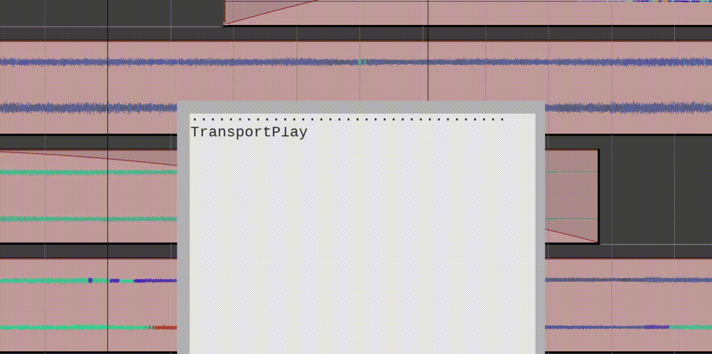
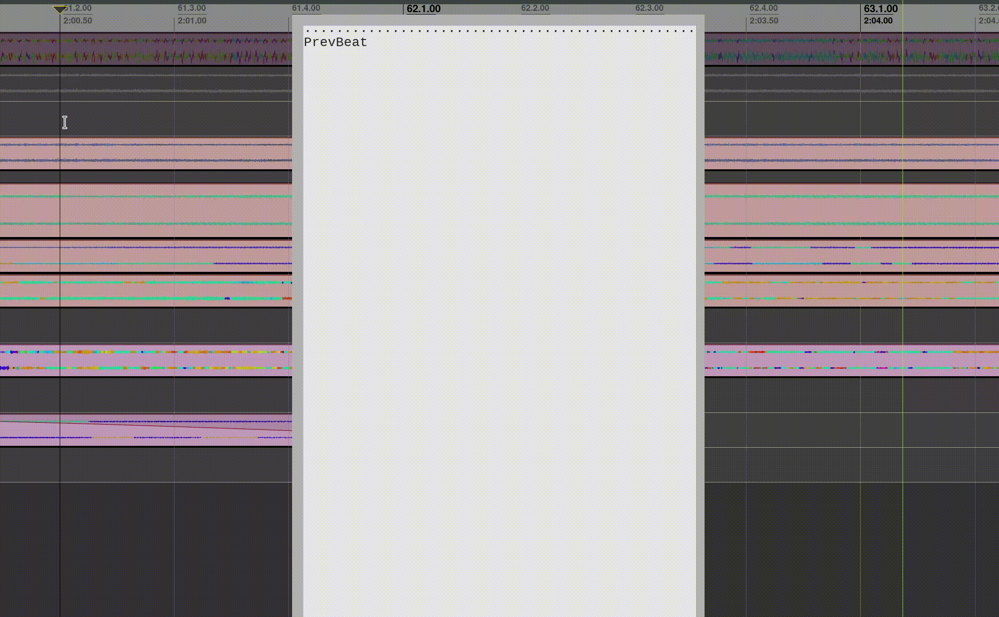
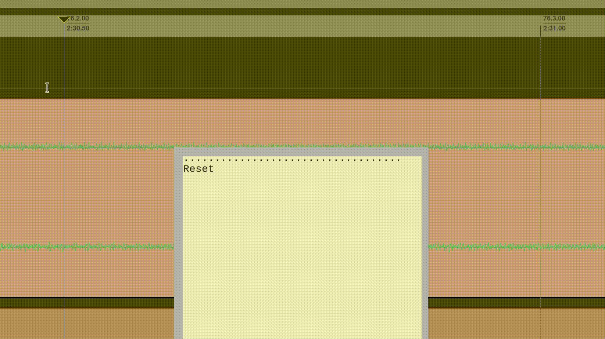

# Reaper-Keys

  

Reaper-Keys is an extension for the [REAPER DAW](https://www.reaper.fm/), that provides a new action
mapping system based on key sequences instead of key chords. The system is
similar to [Vim](https://en.wikipedia.org/wiki/Vim_%28text_editor%29), a modal text editor, and by default comes with vim-like bindings.

Click [here](https://youtu.be/ChuZswEfQuo) for a demo video.

## Pros

- Saving a couple minutes per hour
- Developing arthritis at 60 instead of 40
- Ability to reduce mouse usage
- Increased maximum bandwidth between your brain and the track your mixing

# Table of Contents

  1.  [Features](#Features)
      1.  [Bind key sequences](#Bind-key-sequences)
      2.  [Compose actions](#Compose-actions)
      3.  [Multi-modal](#Multi-modal)
      4.  [Macros](#Macros)
  3.  [Installation](#Installation)
  4.  [Help](#Help)
  5.  [Further Information](#Further-Information)

## Features

### Bind key sequences

With reaper-keys, you may bind key sequences to actions, rather then singular
key presses. This allows one to make use of mnemonics, such as 't' for track,
or 'a' for arming.

A completion/feedback window is provided to assist with command completion. Here
is an example of navigating through the menu to render a project.

### Compose actions

Reaper-keys lets one compose actions of different types to create new commands.

For example, in normal mode, any action with `timeline motion` type can follow any one with `timeline operator` type. Also, most `timeline motion` types allow one to prefix a number to indicate repetitions.

So if one enters `c2L` it would compose into `(c = "Change", L = [2, "NextMeasure"])`,
and trigger a command to set up a record loop and record over the next 2 measures.

To select the items in the next 2 measures, one could enter `s2L`.

This grows the number of available actions exponentially but still preserves your
brain, as you only need to know the `timeline_motions`, `timeline_operators`, and
the fact that you can compose them.

### Multi-modal

Changing modes changes the way keys compose. By default, it is in `normal` mode, but you could for example go into `visual timeline` mode by pressing `v`.

In this mode, `timeline motions` extend the current time selection, and `timeline actions` operate immediately and return one to `normal` mode. Useful if you want
visual feedback before executing a timeline action, or just want to extend the
time selection using motion commands.

### Macros

Macros are a way to save a sequence of commands, and play them back later.

To record a macro, enter `q` and an arbitrary character to specify the `register` that
the macro will save into. Then, perform a series of actions, and finish
recording by pressing `q`.

You may play it back by entering `@` and the character you specified earlier.
Optionally, prefix it with a number to indicate the number of repetitions.

Here is an example of recording and playing a macro that deletes item parts across
two tracks in a ribbon style.

## Installation

- Clone this repository or download it via the 'releases' tab (download the file 'reaper-keys.zip').
- Put this repository into your `REAPER/Scripts` directory . If you're unsure where your `REAPER` directory is, just run the action 'Show REAPER resource path in explorer' in REAPER.
- Back up your key map by exporting it, then import the provided keymap `reaper-keys.ReaperKeyMap` via the `import` button at the bottom of the action list window in Reaper. (This will overwrite your current key bindings!)
- For all the actions to work, install the [SWS/S&M](https://sws-extension.org/) extension for Reaper.

When you restore your old keymap, you may want to empty the `reaper-kb.ini` in your `REAPER` root directory and restart REAPER. Otherwise, there will likely be remnants from reaper-keys.

## Help

Enter `<SPC>h` to print a list of available bindings, their action types, as well as the available
action sequences for the current context and mode.

If your stuck in a state you don't know how to get out of, you can press `<ESC>` to reset back to normal.

## Further Information

Check out the [documentation](https://gwatcha.github.io/reaper-keys) to learn more.
