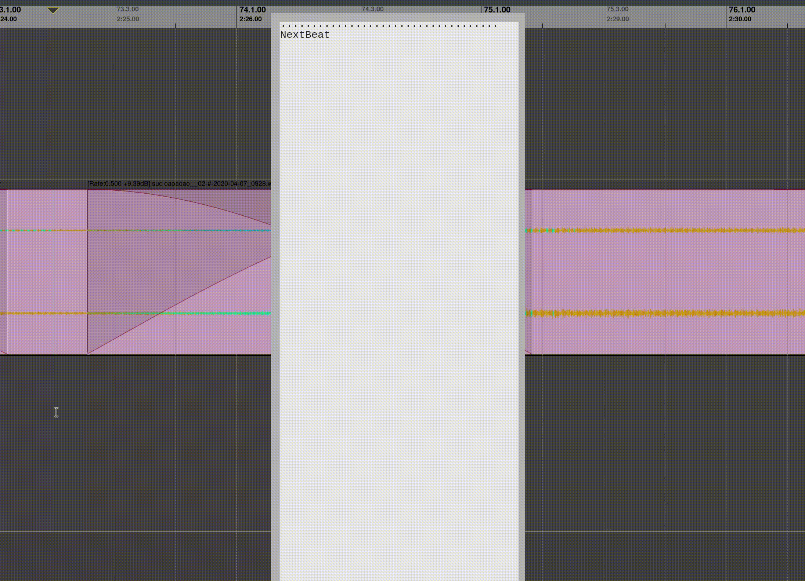

# Table of Contents

1.  [Reaper-Keys](#orgd8e6851)
    1.  [Pros](#org6d3f882)
    2.  [Features](#org3a140db)
        1.  [Bind key sequences](#org73e3c2a)
        2.  [Compose actions](#orgfa15ef8)
        3.  [Multi-modal](#org6d6832b)
        4.  [Macros](#org29b1cfd)
    3.  [Installation](#org423eaf3)
    4.  [Configuration](#org418e23d)
    5.  [Future Plans](#org96ebdb4)

# Reaper-Keys

Reaper-Keys is an extension for the [REAPER DAW](https://www.reaper.fm/), that provides a new action
mapping system based on key sequences instead of key chords. The system is 
very similar to [Vim](https://en.wikipedia.org/wiki/Vim_%28text_editor%29), a modal text editor, and by default comes with vim-like bindings. 

Reaper-keys provides features like composable actions, macros, multiple edit
modes and more.

## Pros

-   Saving a couple minutes per hour
-   Developing arthritis at 60 instead of 40
-   Reduced mouse usage
-   A more fluid experience

## Features

### Bind key sequences

With reaper-keys, you may bind key sequences to actions, rather then singular
key presses. This allows one to make use of mnemonics, such as 't' for track,
or 'a' for arming.

A completion/feedback window is provided to assist with command completion. Here
is an example of navigating through the menu to render a project.

### Compose actions

Reaper-keys  lets one compose actions of different types to create new commands.
For example, any `timeline motion`  action can follow any  `timeline operator`
action, and any `number` can prefix a `timeline motion`.

If one enters `c2L` it would compose into `(c = "Change", 2, L = "NextMeasure")`,
and trigger a command to set up a record loop and record over the next 2 measures.

To select the items in the next 2  measures, one could enter `s2L`.

This grows the number of available actions exponentially but still preserves your
brain, as you only need to know the `timeline_motions`, `timeline_operators`, and
the fact that you can compose them. 

### Multi-modal

Changing modes changes the way keys compose. By default, it is in `normal` mode, but you could for example go into `visual timeline` mode by pressing `v`.

In this mode, `timeline motions` extend the current time selection, and `timeline
actions` operate immediately and return one to `normal` mode. Useful if you want
visual feedback before executing a timeline action, or just want to extend the
time selection using motion commands.

### Macros

Macros are a way to save a sequence of commands, and play them back later.

To record a macro, enter `q` and an arbitrary character to specify the `register` that
the macro will save into. Then, perform a series of actions, and finish
recording by pressing `q`. 

You can play it back by entering `@` and the character you specified earlier.

Here is an example of recording and playing a macro that deletes item parts across
two tracks in a ribbon style.

## Installation

-   Clone this repository or download it via the 'releases' tab.
-   Put this repository into your  `REAPER/Scripts`  directory . If you're unsure where your `REAPER` directory is, just run the action 'Show REAPER resource path in explorer' in REAPER.
-   Back up your key map by exporting it, then import the provided keymap `reaper-keys.ReaperKeyMap` via the `import` button at the bottom of the action list window in Reaper. (This will overwrite your current key bindings!)
-   For all the actions to work, install the [SWS/S&M](https://sws-extension.org/)  extension for Reaper .

## Configuration

All you need to configure reaper-keys is under the `definitions` directory.  
Take a look at the `definitions/README` file for more details.

## Future Plans

-   A GUI for adding new key bindings.
-   A GUI for the help window.
-   Registers for storing and retrieving all sorts of things such as fx chains,
    track selections, items, snapshots.

